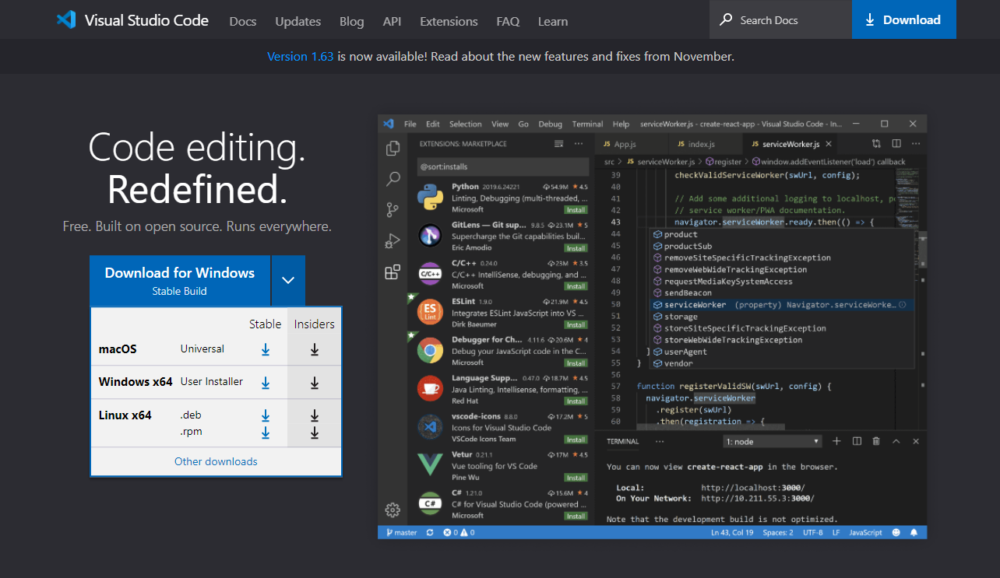
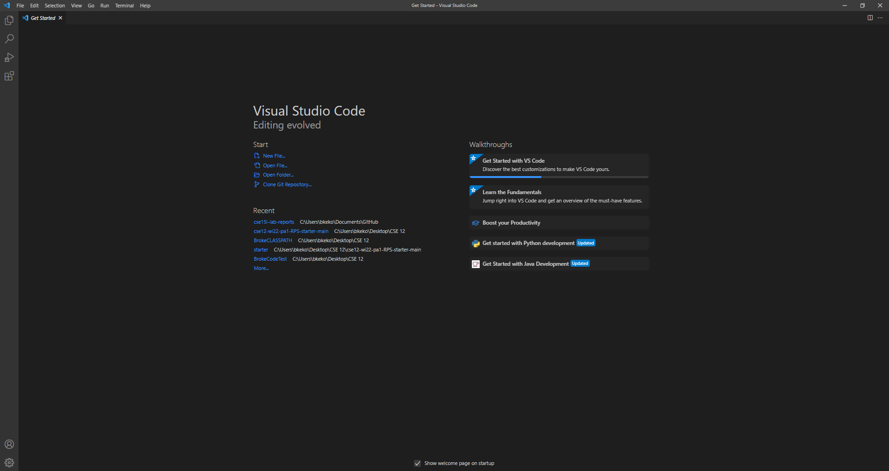
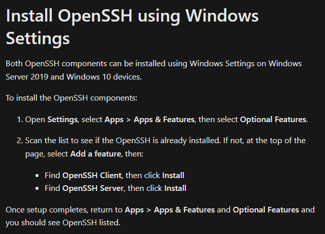
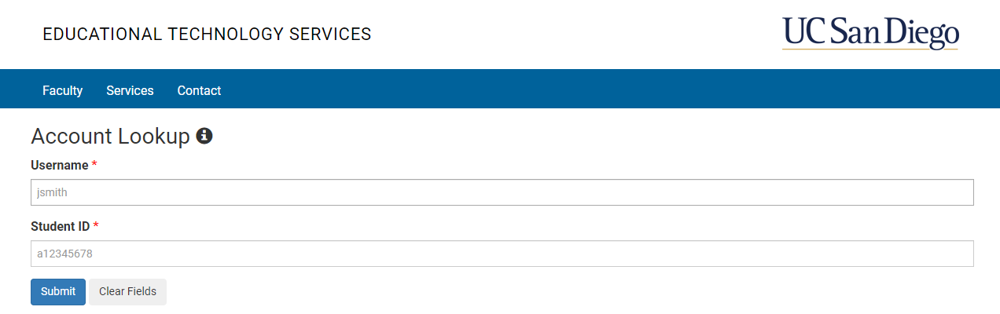
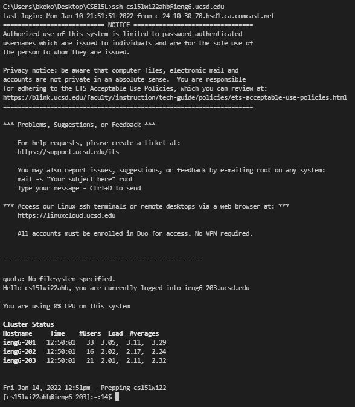
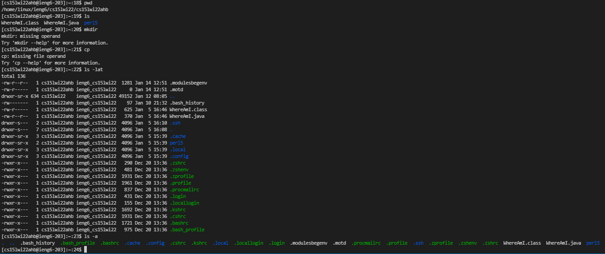
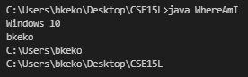
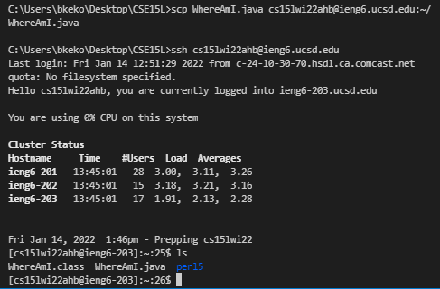
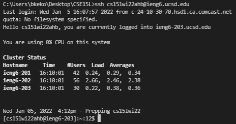
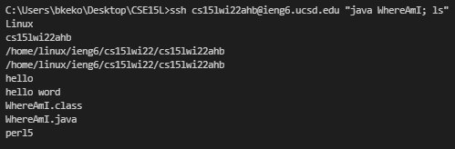

# **Logging into an account on ieng6** #

## Installing VScode ##

Go to the VScode website [here](https://code.visualstudio.com/) and follow the instructions. There is a dropdown to show the different possible versions (macOS, Windows, Linux). Download the *Stable* build.

Then boot up VSCode. It should look something like this:

---
## Remotely Connecting ##

First, *if you are on Windows* set up [OpenSSH](https://docs.microsoft.com/en-us/windows-server/administration/openssh/openssh_install_firstuse)

Then find your ieng6 account (CSE15L in this case) [here](https://sdacs.ucsd.edu/~icc/index.php).

Next, we will connect remotely in VSCode. With VSCode open, open a new terminal either through the top left of VSCode or `ctrl` or `cmd` and `+`. Input the command `ssh cs15lwi22##@ieng6.ucsd.edu` in the terminal but with your ieng6 account id instead of the **##**. `ssh` means secure shell, which is what you will be using. You will receive some messages upon logging in for the first time. Type *yes* and type your password when prompted. Your terminal should look similar (**not exactly**) to this:

---
## Trying Some Commands ##

Some useful commands that you can try include:

`cd <directory>` change directory

`ls <directory (blank implies current directory)>` list (files and directories)

`pwd` print working directory

`mkdir <new directory>` make directory

`cp <file>` copy

To log out:

`Ctrl` or `Cmd` + `D` or run `exit`

---
## Moving Files with `scp` ##

`scp` (secure copy) allows us to copy a file(s) from a client (your computer) to a server (ieng6 computer). You can create any file, but I will use a file named `WhereAmI.java` from CSE15L Lab 1.

Compile and run the code. It may look something like this:

Then run `scp <YOUR FILE> cs15lwi22##@ieng6.ucsd.edu:~/` with your own file, your own ieng6 account instead and type in your password when prompted. Log in to the ieng6 computer and run `ls` and you should see your file in the ieng6 computer. You can compile and run it and see your program run.

---
## Setting an SSH Key ##

SSH keys form a relationship between your computer and the server using public and private keys. The private key (yours) will substitute as a password when matched with the server's public key.

First, you want to create a public key and private key by running `ssh-keygen`. It will prompt you asking what the new passphrase will be and you are give the option to submit no passphrase. The private key will be in the file `id_rsa` and the public key in `id_rsa.pub` which are both stored on in the `.ssh` directory on the client computer.

Next, you must copy the **public** key to the server, but you first need to create the directory to store the key on the server. Log in and run the command `mkdir .ssh` which *makes the directory named `.ssh`*. Log out then copy the key into the directory you just made by running `scp /YOUR DIRECTORY/.ssh/id_rsa.pub cs15lwi22##@ieng6.ucsd.edu:~/.ssh/authorized_keys`. You need to substitute your own key directory and your own ieng6 account in the command because you want to copy *your own* public key to *your own* account. You can now login without typing in your password (or with the password you set for the keys):

---
## Optimizing Remote Running ##

In order to run a command quickly on the ieng6 computer and exit after (looks like you are running the server command from the client) you run `ssh cs15lwi22##@ieng6.ucsd.edu "<command>"` with your ieng6 account.

Additionally, you can run multiple commands by separating individual commands with a semicolon (;), but make sure that if you want to run several commands on the server you include the quotes ("") as they determine what will be ran on the server.

Other quality-of-life details: up-arrow or down-arrow to scroll through your history of commands and `tab` to autofill a command.

