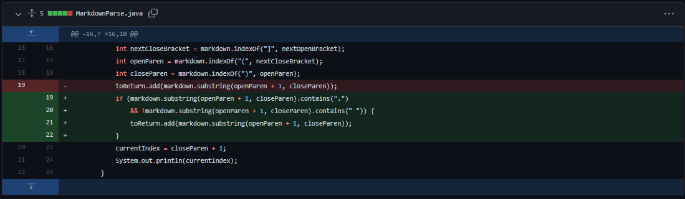
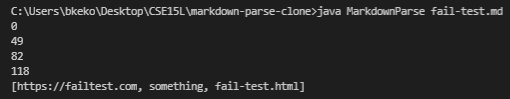
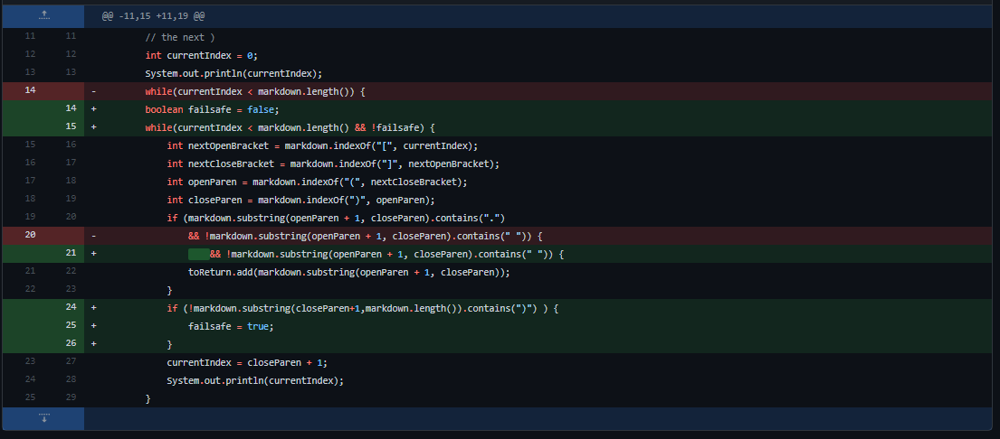
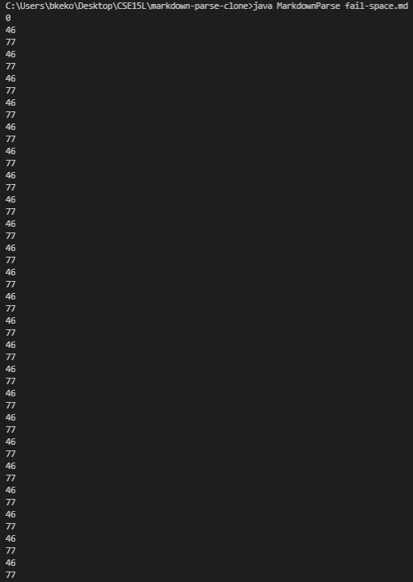
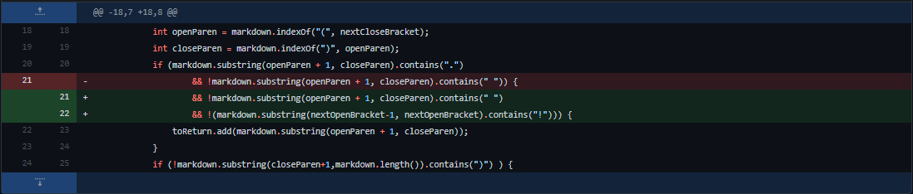
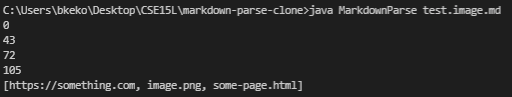

# Debugging #

## Bug #1: Invalid Links being Read ##

Code Change:

The New Code Fixes: [Text in between links](github.com/breponte/cse15l-lab-reports/blob/main/failtest/fail-test.md)

Symptom:

The bug was the code's method of identifying any links. The code only identified a link by "(", ")", "[", and "]" in order, so the program did not care if there existed an invalid or incomplete link as long as there were parenthesis and brackets. This caused the symptom of invalid links to be returned by the getLinks method. This was caused because the input had a "" in the file which is not a real link, yet something was still returned.

## Bug #2: Infinite Loop ##

Code Change:

The New Code Fixes: [Extra line at the end](github.com/breponte/cse15l-lab-reports/blob/main/failtest/fail-space.md)

Symptom:

The bug was that the program kept searching for links even though all the files were already checked. The current index would be set to a number past all the links in the file and the indexOf method's property of returning -1 when something is not found would set currentIndex to reset back to the middle of the file. This would cause the code to repeat itself constantly as there is no stopping point since currentIndex keeps resetting. Since I am printing out current index, the visible symptom of this bug would show currentIndex being set between two values endlessly. This symptom was due to the program reading a file with an extra line, and so it was checking for any brackets or parenthesis in the extra line but returned -1 because it could not be found.

## Bug #3: Reading Images as Links ##

Code Change:

The New Code Fixes: [Ignoring images](github.com/breponte/cse15l-lab-reports/blob/main/failtest/test.image.md)

Symptom:

The bug was, again, the code's method of identifying any links. More specifically, the program was reading images as well since images in markdown used a similar structure to links. Images were declared by `!(Image)[something.png]` and links were declared by `(Custom text)[link.md]`. The symptom would be that images were returned with the list of links with the getLinks method. The simple failure-inducing input was including a image, since it was going to be read as a link.