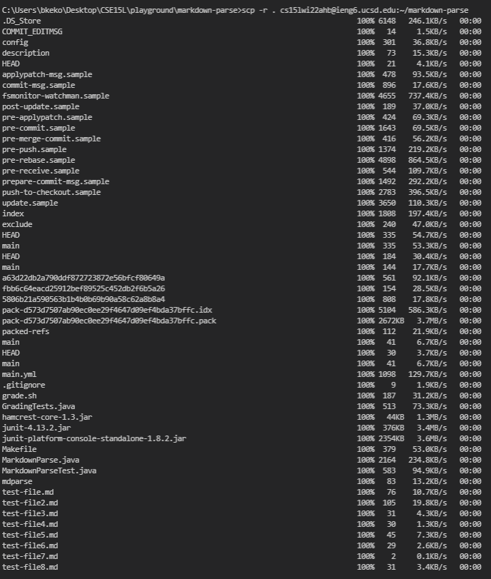
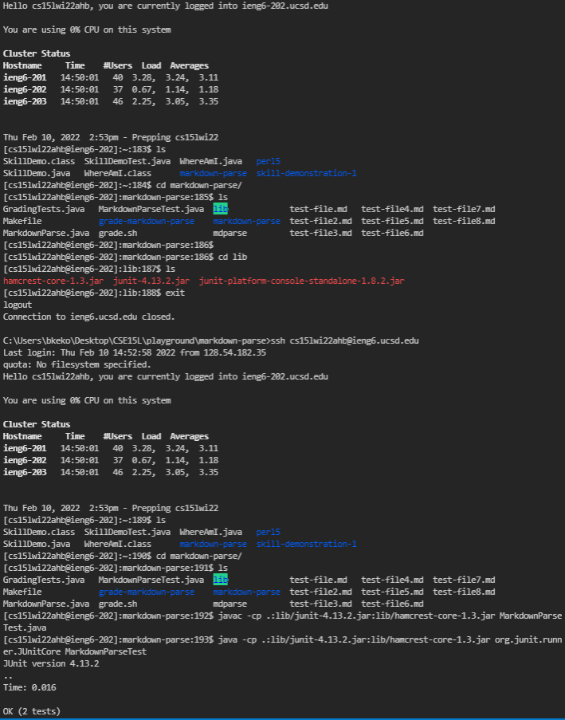
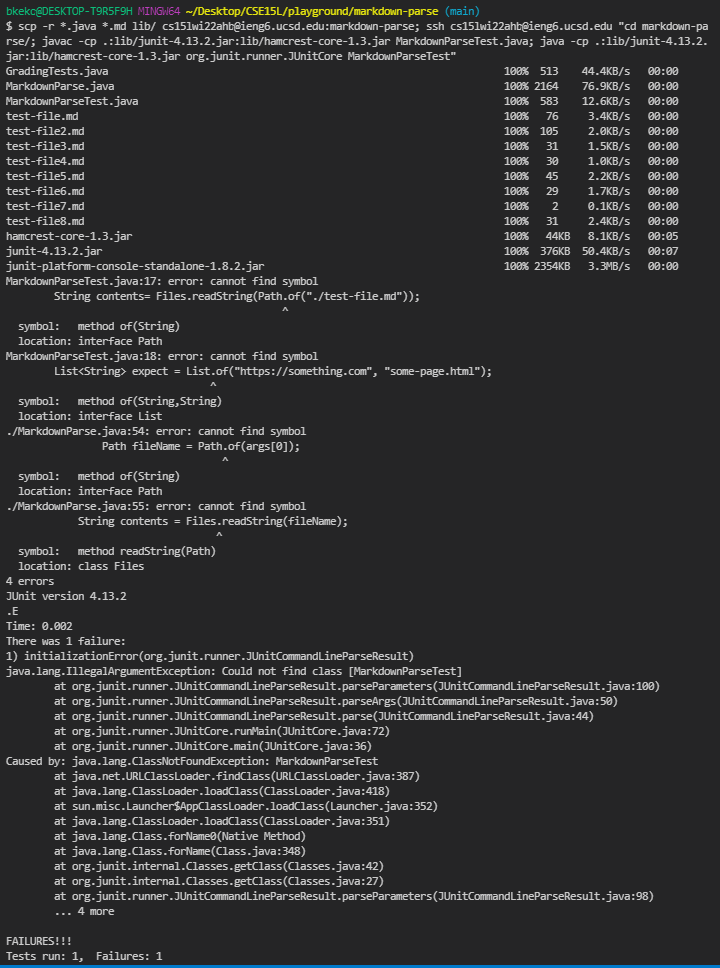
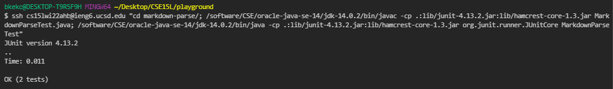

# Copying Whole Directories with `scp -r`

I used `scp -r . cs15lwi22@ieng6.ucsd.edu:~/markdown-parse` which recursively `-r` copies all files from the current working directory `.` into a markdown-parse folder in the default directory of the ieng6 computer. Since I did not specify which files I wanted to copy, it copied all files in the directory. This command conceptually copies each individual file into the server because of `-r` which denotes recursive action of the command `scp`.

I manually check that the new files exist on the ieng6 server. Now that the necessary files for markdown-parse exist, I compile and run the code on the ieng6 server successfully. The tests pass so I know that the files from my local computer were copied correctly.

I attempt to combine `scp` and `ssh` in order to copy the folder from my own local computer onto the ieng6 and run the files on the server from my local computer. The following image shows that it is technically possible as it tries to compile and run. Running the same line of commands (even as a combined command) on the ieng6 server works, but when I try to run it from my local computer using the `ssh` command with the same commands as argument (even just `javac`) it cannot compile correctly. Other people had the same problems in this post on the CSE15L piazza (I don't know if I have to cite professionally): [Original Problem](https://piazza.com/class/kxs0toocqhv4og?cid=353)

However, the problem was due to a conflict in java versions between my local computer and the ieng6 computer. Joe proposed a [solution](https://piazza.com/class/kxs0toocqhv4og?cid=354) in the comments that works. Although not practical, the next image shows that it is actually possible to run a single line that copies several files and folders to the ieng6 computer and runs some of those files afterwards on the ieng6 computer.

